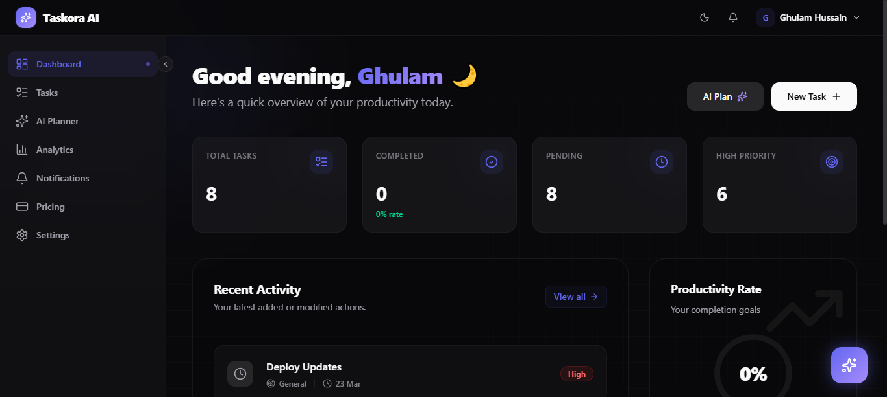
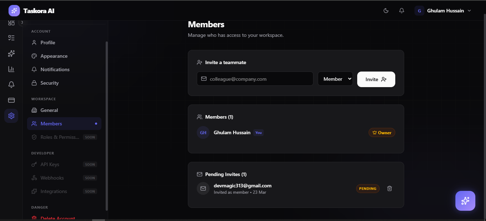
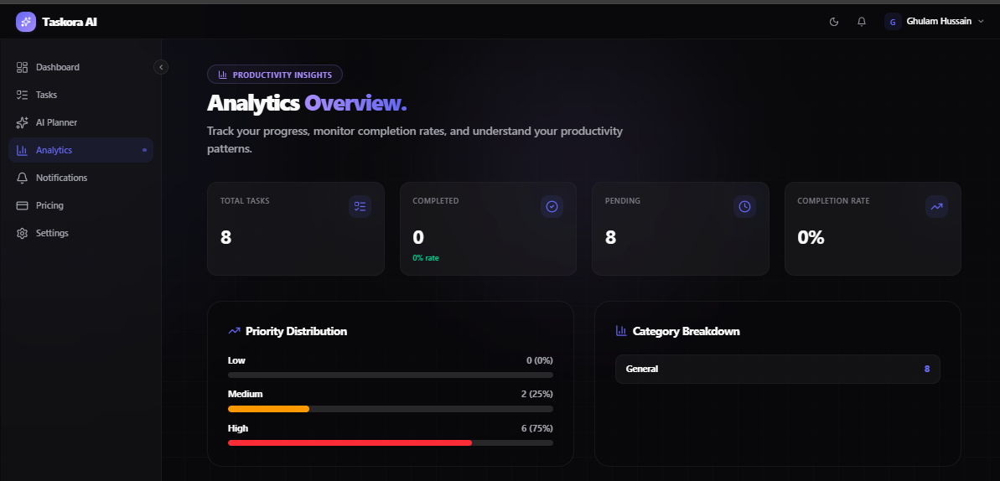

  
  
  # ✦ Taskora AI
  
  **AI-Powered SaaS Task Management for Modern Teams**

  
  
  
  
  

  

    <a href="#live-demo">Live Demo</a> •
    <a href="#about-the-project">About</a> •
    <a href="#key-features">Features</a> •
    <a href="#getting-started">Installation</a> •
    <a href="#ai-features">AI Capabilities</a> •
    <a href="#contributing">Contribute</a>
  

---

## 🚀 Live Demo
> **[View Live Demo 🔗](https://taskora.ai)** *(Update with real link)*

  

---

## 📖 About the Project

**Taskora AI** is a next-generation SaaS task management application designed to supercharge your productivity. Built with modern web technologies, it seamlessly blends traditional project management with contextual AI assistance.

Whether you're a solo developer tracking personal goals or a team collaborating across workspaces, Taskora AI helps you organize, prioritize, and generate tasks instantly using lightning-fast AI models.

### Why Taskora AI?
Traditional task managers require manual entry and endless sorting. Taskora AI acts as your intelligent co-pilot:
- **Zero Friction:** Let AI break down complex goals into actionable tasks automatically.
- **Auto-Prioritization:** AI analyzes your workload and reprioritizes your schedule dynamically.
- **Collaborative Workspaces:** Native support for multi-tenant workspaces, granular roles, and email invitations.

---

## ✨ Key Features

### 🤖 AI-Powered Productivity
- **AI Task Generation:** Convert high-level goals into step-by-step actionable tasks.
- **Intelligent Reprioritization:** Automatically organize your tasks based on deadlines and urgency.
- **AI Chat Assistant:** A built-in chat bubble that helps you manage your workflow conversationally.

### 📋 Advanced Task Management
- **Rich Task Metadata:** Track descriptions, categories, priorities, dates, comments, and notes.
- **Detailed Audit Logging:** Comprehensive `task_logs` table tracking exactly when and how tasks change.
- **Analytics Dashboard:** Visualize your productivity metrics and completion rates over time.

### 🏢 Workspaces & Collaboration
- **Multi-Tenant Workspaces:** Create distinct workspaces for different projects or clients.
- **Role-Based Access Control (RBAC):** Assign Owner, Admin, Member, or Viewer roles.
- **Email Invitations:** Integrated with Resend to seamlessly invite teammates to workspaces.

### 🔒 Enterprise-Grade Security
- **Supabase Authentication:** Secure login flows with magic links and OAuth.
- **Row Level Security (RLS):** Strict PostgreSQL policies ensuring data privacy between workspaces.

---

## 🛠 Tech Stack

| Category | Technology |
| :--- | :--- |
| **Frontend** | [Next.js](https://nextjs.org/) (App Router), [React 19](https://react.dev/), [Tailwind CSS v4](https://tailwindcss.com/) |
| **State & Forms** | [Zustand](https://zustand-demo.pmnd.rs/), [React Hook Form](https://react-hook-form.com/), [Zod](https://zod.dev/) |
| **Backend / BaaS**| [Supabase](https://supabase.com/) (PostgreSQL, Auth, Storage) |
| **AI Integration** | [Groq API](https://groq.com/) (via OpenAI SDK), Next.js generic streaming |
| **Email Service** | [Resend](https://resend.com/) (Native Fetch Implementation) |
| **Icons & UI** | [Lucide React](https://lucide.dev/), [React Hot Toast](https://react-hot-toast.com/) |

---

## 📂 Project Structure

\`\`\`bash
taskora-ai/
├── src/
│   ├── app/                # Next.js App Router (Pages & API Routes)
│   │   ├── (app)/          # Authenticated routes (Dashboard, Settings, AI Planning)
│   │   └── api/            # Serverless functions (AI Streaming, Workspace Invites)
│   ├── components/         # Reusable globally shared UI components
│   ├── features/           # Feature-based modular architecture
│   │   ├── ai/             # AI components, API clients, and hooks
│   │   ├── analytics/      # Dashboard and charts
│   │   ├── auth/           # Authentication logic and context
│   │   ├── settings/       # Profile, Security, and Settings screens
│   │   ├── tasks/          # Task lists, creation, and management
│   │   └── workspace/      # Multi-tenant workspace logic
│   └── lib/                # Utilities (Supabase clients, Resend email logic)
├── supabase/               # Database schema, migrations, RLS policies
└── ...config files         # Tailwind, ESLint, TypeScript config
\`\`\`

---

## 🚦 Getting Started

### Prerequisites
- Node.js 18.x or higher
- A [Supabase](https://supabase.com/) project
- A [Groq](https://console.groq.com/) account for AI API keys
- A [Resend](https://resend.com/) account for email sending (optional for local dev)

### Installation

1. **Clone the repository**
   \`\`\`bash
   git clone https://github.com/DevMagic313/Taskora-AI.git
   cd Taskora-AI
   \`\`\`

2. **Install dependencies**
   \`\`\`bash
   npm install
   \`\`\`

3. **Set up the database**
   Run the SQL script located at \`supabase/schema.sql\` inside your Supabase project's SQL Editor to create tables, triggers, and RLS policies.

4. **Set up environment variables**
   Rename \`.env.example\` to \`.env.local\` and fill in the required keys (see table below).

5. **Start the development server**
   \`\`\`bash
   npm run dev
   \`\`\`
   Your app should now be running on [http://localhost:3000](http://localhost:3000).

---

## 🔐 Environment Variables

Create a \`.env.local\` file in the root of your project:

| Variable | Description | Where to find |
| :--- | :--- | :--- |
| \`NEXT_PUBLIC_SUPABASE_URL\` | Your Supabase Project URL | [Supabase API Settings](https://supabase.com/dashboard/project/_/settings/api) |
| \`NEXT_PUBLIC_SUPABASE_ANON_KEY\`| Your Supabase Anon Public Key | [Supabase API Settings](https://supabase.com/dashboard/project/_/settings/api) |
| \`GROQ_API_KEY\` | API key for lightning-fast AI models | [Groq Console](https://console.groq.com/keys) |
| \`NEXT_PUBLIC_SITE_URL\` | URL of your deployed application | Usually \`http://localhost:3000\` locally |
| \`SUPABASE_SERVICE_ROLE_KEY\` | Secret key bypassing RLS (Used for account deletion & admin tasks) | [Supabase API Settings](https://supabase.com/dashboard/project/_/settings/api) |
| \`RESEND_API_KEY\` | API key for sending workspace invite emails | [Resend Dashboard](https://resend.com/api-keys) |

>*Note: Never expose your `SUPABASE_SERVICE_ROLE_KEY` to the client side.*

---

## 🧠 AI Features Deep-Dive
Taskora AI heavily utilizes the **Groq API** (compatible with OpenAI's SDK) for nearly instantaneous AI responses:

- **Goal Breakdown (`/api/ai/generate-tasks`):** Users enter a high-level goal, and the AI streams back a structured JSON checklist of necessary tasks.
- **Smart Reprioritization (`/api/ai/reprioritize`):** The AI evaluates the current task list against deadlines and user metrics to suggest localized priority updates.
- **Contextual Chat Assistant (`AIChatBubble.tsx`):** A floating AI assistant holding context of the user's current workspace to answer workflow questions.
- **AI History Tracking:** The `ai_generation_history` database table logs every prompt and generated outcome for future auditing and context resumption.

---

## 📸 Screenshots

| Dashboard | AI Task Generator |
| :---: | :---: |
|  |  |
| **Workspace Settings** | **Analytics View** |
|  |  |

*(Add actual screenshots to a `/docs` folder and update these paths)*

---

## 🗺 Roadmap

- [ ] **Mobile Application:** React Native companion app for on-the-go task management.
- [ ] **Calendar Integrations:** Two-way sync with Google Calendar and Outlook.
- [ ] **Kanban Board View:** Drag-and-drop task management alongside the list view.
- [ ] **Advanced AI Context:** Let the AI read previous completion logs to estimate task duration automatically.
- [ ] **Custom Roles:** Granular permission system expanding beyond preset roles.

---

## 🤝 Contributing

Contributions make the open-source community an amazing place to learn, inspire, and create. Any contributions you make are **greatly appreciated**.

1. Fork the Project
2. Create your Feature Branch (\`git checkout -b feature/AmazingFeature\`)
3. Commit your Changes (\`git commit -m 'Add some AmazingFeature'\`)
4. Push to the Branch (\`git push origin feature/AmazingFeature\`)
5. Open a Pull Request

---

## 📜 License

Distributed under the MIT License. See \`LICENSE\` for more information.

---

## 👨‍💻 Author

**Ghulam Hussain | DevMagic**
- GitHub: [@DevMagic313](https://github.com/DevMagic313)
- Portfolio: [codewithgh.vercel.app](https://codewithgh.vercel.app)

---

Made with ❤️ by DevMagic

